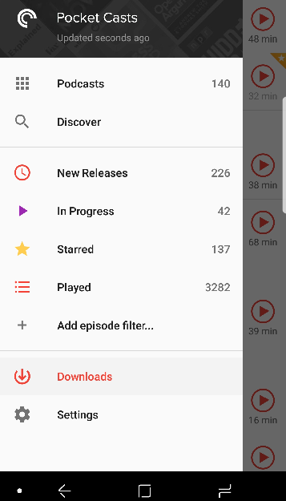

# Random Podcast Machine
## No libraries, no frameworks
Repo to upload and improve upon my random podcast project (incl. JSON data to query).

Inspired by the fCC "Random Quote Machine" project.

Aims: practice JS, have a go at using AJAX, work with JSON, practice basic CSS grid layouts.

# Primary goals (in order):
- [x] ~~Very basic (very ugly) layout/design - index and css currently not visible on github due to design!~~
- [x] Javascript to bring in ~~random quote from array~~ - now using JSON (see stretch goals) and podcasts
- [x] Display podcast image
- [x] Tweet button (integrated as image URL)
- [x] Image alt text
- [x] Slightly less ugly design
- [x] Responsive layout and font size

# Longer-term ("stretch") goals:
- [] Prettier, more responsive design (incl image)
- [x] Javascript to bring in random *podcast* from *object*
- [x] Host JSON in separate file (on GitHub) and query as an API, using vanilla (plain) JS
- [x] Include "categories" from JSON as hashtags in tweet
- [x] Add podcast generator history
- [x] Add tweet buttons for items in history
- [x] Wrap images in history properly
- [x] Limit history to X entries, instead of just resetting it after each 12... Update: decided to make history limited to 12 entries max, but no hard reset (thanks to good old array methods). See for yourself by generating >12 

# "Nice to have"s
- [] Avoid repeating random suggestions
- [x] Reverse order of history? (very easy fix - used "afterbegin" instead of "beforeend")
- [x] Increase number of podcasts in JSON
- [x] Auto-load podcast recommendation (window.onload button click - easy peasy)

# Evidence for my love of podcasts:
Here's a recent screenshot from my PocketCasts app. 140 subscriptions and 3,282 played!
